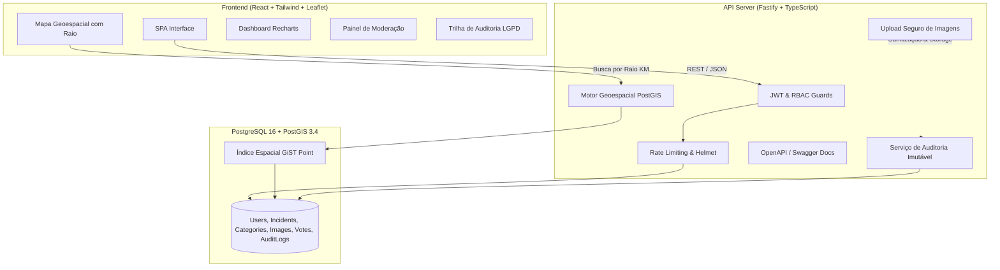

# 📢 Voz do Bairro (Bairro Alerta)

> **Plataforma Colaborativa de Zeladoria Urbana e Alertas Comunitários com Inteligência Geoespacial (PostGIS).**

[](https://www.typescriptlang.org/)
[](https://nodejs.org/)
[](https://fastify.dev/)
[](https://react.dev/)
[](https://www.postgresql.org/)
[](https://postgis.net/)
[](https://tailwindcss.com/)
[](https://www.docker.com/)
[](https://vitest.dev/)
[](LICENSE)

---

## 🌟 Visão Geral

O **Voz do Bairro** é um ecossistema completo (API + Web App) desenvolvido para aproximar munícipes, lideranças comunitárias e a administração pública municipal. Ele permite o reporte em tempo real de demandas de zeladoria urbana (como postes apagados, crateras em vias, descarte de entulho e focos de dengue) com **geolocalização precisa (PostGIS)**, upload de fotos, linha do tempo de resolução e métricas em dashboard analítico.

---

## 🏛️ Arquitetura do Sistema



---

## 🚀 Destaques Técnicos

1. **Inteligência Geoespacial com PostGIS:**
   - Consultas de raio e proximidade via `ST_DWithin` com coordenadas em projeção WGS84 (`SRID 4326`).
   - Cálculo instantâneo da distância em metros do cidadão até cada ocorrência (`ST_Distance` e `ST_DistanceSphere`).
   - Indexação de alta performance com índices espaciais `GiST`.

2. **Backend de Alta Performance (Fastify):**
   - Roteamento e serialização ultrarrápidos.
   - Documentação OpenAPI / Swagger interativa gerada automaticamente em `/docs`.
   - Autenticação JWT com Controle de Acesso Baseado em Papéis (**RBAC**): `CITIZEN`, `MODERATOR`, `ADMIN`.
   - Proteção de segurança com `@fastify/helmet` e `@fastify/rate-limit`.

3. **Upload Seguro de Imagens:**
   - Validação de magic bytes, tipos MIME autorizados (JPEG, PNG, WebP) e limites de tamanho em streaming.

4. **Trilha de Auditoria & Conformidade (LGPD):**
   - Tabela imutável `audit_logs` que registra qualquer alteração crítica de estado (status, papéis de usuário, exclusões) contendo `old_values` e `new_values` em formato JSONB, endereço IP e identificação do ator.

5. **Frontend Moderno & Responsivo (React + Tailwind + Leaflet):**
   - Mapa interativo com pinos estilizados por categoria e status de resolução.
   - Controle deslizante dinâmico de raio de busca (1km a 25km) com círculo translúcido desenhado no mapa.
   - Dashboard executivo com KPIs, taxas de resolução e gráficos interativos (**Recharts**).
   - Seletor de coordenadas por clique para novos reportes.
   - Acesso rápido de demonstração (1 clique) para alternar entre Cidadão, Moderador e Administrador.

---

## 👤 Credenciais Padrão para Teste

Ao executar o seed do banco de dados, os seguintes usuários de demonstração estão disponíveis:

| Papel | E-mail | Senha | Acesso / Recursos |
| :--- | :--- | :--- | :--- |
| **Administrador** | `admin@vozdebairro.com.br` | `Admin@123` | Acesso total: Mapa, Dashboard, Triagem, Gestão de Usuários e Trilha de Auditoria. |
| **Moderador** | `moderador@vozdebairro.com.br` | `Mod@123` | Mapa, Dashboard e Painel de Triagem/Moderação (Aprovar, Rejeitar, Iniciar Reparo, Concluir). |
| **Cidadão** | `cidadao@vozdebairro.com.br` | `Cidadao@123` | Mapa, Registro de novos chamados, Comentários e Apoios (*upvotes*). |

---

## ⚡ Como Executar

### Opção 1: Executando com Docker Compose (Recomendado)

Suba toda a infraestrutura (Postgres com PostGIS, Backend Fastify e Frontend React) com um único comando:

```bash
docker compose up -d --build
```

- **Frontend:** http://localhost:3000
- **API Backend:** http://localhost:3001
- **Documentação Swagger:** http://localhost:3001/docs
- **Healthcheck:** http://localhost:3001/health

---

### Opção 2: Execução Manual em Desenvolvimento

#### 1. Pré-requisitos
- Node.js >= 20.x
- PostgreSQL com PostGIS instalado localmente (ou rodando via Docker)

#### 2. Backend
```bash
cd backend
npm install
npm run migrate  # Cria tabelas, extensões PostGIS e índices
npm run seed     # Popula usuários e ocorrências de exemplo
npm run dev      # Inicia o servidor Fastify em http://localhost:3001
```

#### 3. Frontend
```bash
cd frontend
npm install
npm run dev      # Inicia o Vite em http://localhost:3000
```

---

## 🧪 Testes Automatizados

O backend conta com suíte de testes unitários e de integração desenvolvida em **Vitest**:

```bash
cd backend
npm test
```

Os testes cobrem:
- Validação de schemas e hashing de senhas bcrypt (`auth.test.ts`).
- Coordenadas geográficas, limites de latitude/longitude e cálculos esféricos PostGIS (`incidents.test.ts`).
- Transições de estado de ocorrências e regras de permissão RBAC (`moderation.test.ts`).

---

## 🔄 Pipeline CI/CD

O projeto já inclui configurações completas de integração contínua para **GitLab CI/CD** e **GitHub Actions**:

- `.gitlab-ci.yml`: Estágios de `lint`, `test` (com serviço `postgis/postgis:16-3.4`), `build` e `containerize`.
- `.github/workflows/ci.yml`: Workflow com container de banco PostGIS para execução automática a cada `push` ou `pull_request`.

---

## 📂 Estrutura de Pastas

```
voz-do-bairro/
├── backend/
│   ├── src/
│   │   ├── config/          # Variáveis de ambiente com Zod, Logger Pino
│   │   ├── database/        # Pool pg, PostGIS init.sql, Migrations e Seeds
│   │   ├── middlewares/     # JWT Auth, RBAC Guards, Error Handler centralizado
│   │   ├── modules/         # Auth, Users, Incidents, Moderation, Metrics, Audit, Uploads
│   │   ├── types/           # Interfaces TypeScript e Augmentations
│   │   ├── app.ts           # Configuração Fastify, Swagger, CORS, Helmet, Rate Limit
│   │   └── server.ts        # Bootstrap e Graceful Shutdown
│   ├── tests/               # Testes automatizados Vitest
│   ├── Dockerfile
│   └── package.json
├── frontend/
│   ├── src/
│   │   ├── components/      # Navbar, Footer, Cards, Modais, Leaflet Map, Radius Slider
│   │   ├── contexts/        # AuthContext com 1-Click Demo Login
│   │   ├── pages/           # HomePage, DashboardPage, ModerationPage, AuditPage, AuthModal
│   │   ├── services/        # API Client com fallback offline instantâneo
│   │   ├── types/           # Tipos TypeScript do frontend
│   │   ├── App.tsx          # Roteamento e orquestração de modais
│   │   └── main.tsx
│   ├── Dockerfile
│   └── package.json
├── .gitlab-ci.yml           # Pipeline GitLab CI/CD
├── .github/workflows/ci.yml # Pipeline GitHub Actions
├── docker-compose.yml       # Orquestração de containers com PostGIS
└── README.md
```

---

## 📄 Licença

Distribuído sob a licença **MIT**. Veja `LICENSE` para mais informações.
